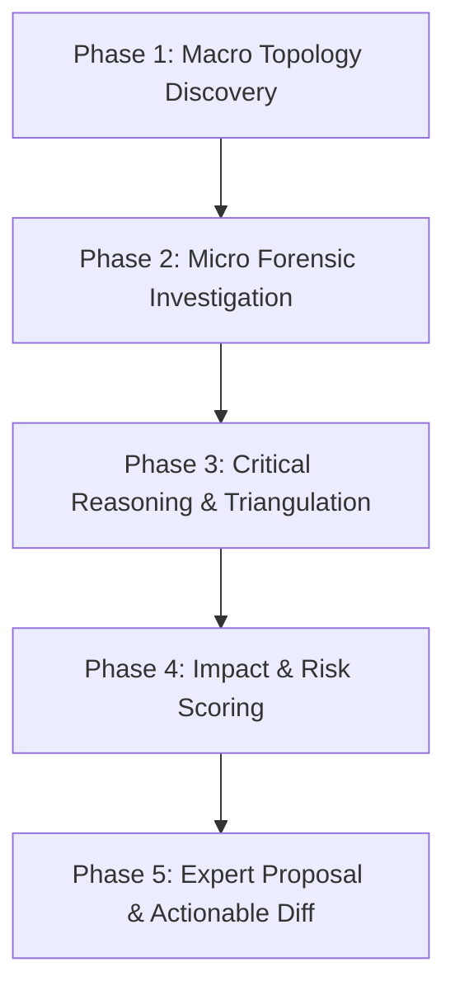

# Codebase Deep Explorer & Senior Architectural Reviewer

This skill defines the rigorous methodologies, cognitive models, forensic techniques, and communication standards for exploring unknown or evolving codebases, conducting deep architectural audits, and delivering high-conviction, senior-staff-engineer feedback.

---

## 🧭 Core Philosophy & Mindset

1. **First-Principles Skepticism**: Never assume code works as intended merely because it compiles or lacks error logs. Trace execution paths to root causal mechanisms.
2. **Zero-Superficiality Rule**: Superficial observations (e.g., "format the indentation", "rename this variable") without addressing systemic architectural integrity, performance bottlenecks, concurrency risks, or state synchronization purity are prohibited.
3. **Cross-Layer Boundary Triangulation**: Desktop applications have multiple distinct execution contexts (Rust OS layer, Tauri IPC bridge, Svelte 5 reactive frontend, Webview DOM). Audit interactions across boundaries, not in isolation.
4. **Constructive & High-Conviction Feedback**: Pair every critique with a concrete, prioritized architectural alternative, trade-off analysis, and remediation blueprint.

---

## 🔬 5-Phase Deep Exploration Workflow

### Phase 1: Macro Topology Discovery (Mapping the Territory)
- **Entrypoints & Initialization Lifecycle**:
  - Rust: `src-tauri/src/main.rs` -> `src-tauri/src/lib.rs` (`tauri::Builder`, plugins, context generation).
  - Frontend: `src/app.html` -> `src/routes/+layout.ts` (SSR settings) -> `src/routes/+layout.svelte` -> `src/routes/+page.svelte`.
- **Security & Capability Boundaries**:
  - Inspect `src-tauri/capabilities/*.json` and `src-tauri/tauri.conf.json` for security scopes, window permissions, and exposed IPC surfaces.
- **State & Data Flow Topology**:
  - Map global stores (`src/lib/stores/*.svelte.ts`), reactive runes (`$state`, `$derived`), and backend state singletons.

### Phase 2: Micro Forensic Investigation (Deep Subsystem Diving)
- **Control Flow & Concurrency**:
  - Trace async boundaries, Rust thread handoffs, and event listeners.
  - Audit for unhandled promise rejections, missing error recovery, and race conditions.
- **Resource Lifecycle & Memory Footprint**:
  - Verify event unlisteners (`unlisten()`) in `onMount` / `$effect` teardown blocks.
  - Check for DOM node leakage, unbounded cache growth, and zombie child processes.
- **IPC Contract & Type Safety**:
  - Verify that TypeScript invocation payloads match Rust command parameter structs byte-for-byte.

### Phase 3: Critical Reasoning & Architectural Triangulation
Deconstruct the findings through 4 critical lenses:
1. **SOLID & Clean Architecture**: Are concerns isolated? Does a UI component orchestrate backend disk I/O directly without abstraction?
2. **DRY & Single Source of Truth**: Is the same state (e.g. window size, theme, connection status) computed or stored in two discordant places?
3. **Defensive Robustness**: What happens if an external executable fails, a file lock is held, or the OS drops an IPC event?
4. **User-Centric Latency & Ergonomics**: Does a background IPC invoke block the 60fps webview UI thread?

### Phase 4: Impact & Risk Scoring
Categorize each identified issue or architectural opportunity by severity:

| Severity | Definition | Action Required |
| :--- | :--- | :--- |
| 🔴 **Critical (P0)** | Memory leaks, security ACL leaks, UI freezing, process hangs | Immediate refactoring / guardrails |
| 🟠 **Major (P1)** | Broken state invariants, architectural coupling, missing error bounds | High-priority redesign |
| 🟡 **Moderate (P2)** | Performance inefficiencies, code duplication, sub-optimal ergonomics | Scheduled structural polish |
| 🟢 **Enhancement (P3)** | DX improvements, typing strictness, documentation clarity | Nice-to-have iteration |

### Phase 5: Senior-Staff Feedback Formulation & Proposal
Format all diagnostic feedback using the **Executive Review Protocol**:
1. **Executive Summary**: 2-3 sentence bottom-line verdict on stability, scalability, and code health.
2. **Key Findings & Evidence Matrix**: Code references (`file:///path#L10-L20`) with direct diagnostic proof.
3. **First-Principles Root-Cause Analysis**: Why the system behaves this way and what future failure modes exist.
4. **Concrete Remediation Roadmap**: Phased, actionable steps with drop-in code diffs.
5. **Trade-Off & Alternatives Matrix**: Pros and cons of proposed architecture vs status quo.

---

## 🛠️ Investigative Checklists & Tools

When initiating a deep dive, consult:
- [`references/deep_exploration_framework.md`](file:///c:/Users/sino/Desktop/ldnoob/.agents/skills/codebase-explorer/references/deep_exploration_framework.md) for cognitive models and forensic vectors.
- [`references/expert_feedback_templates.md`](file:///c:/Users/sino/Desktop/ldnoob/.agents/skills/codebase-explorer/references/expert_feedback_templates.md) for structured feedback templates.
